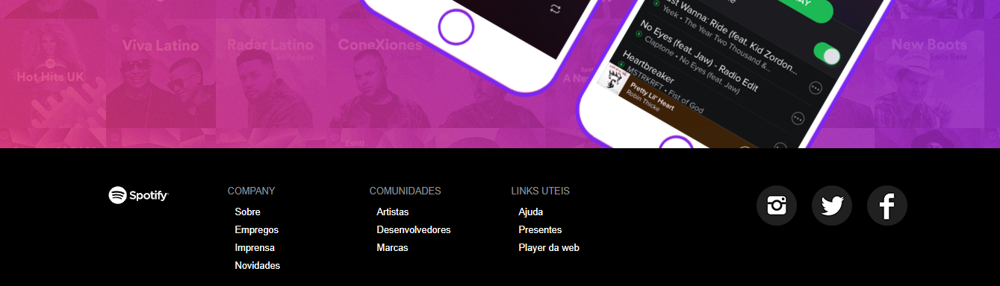

#  Spotify Bootstrap

This is another one of my projects using Bootstrap, this project has responsive designs for all screen types

You can browse through this link: https://drnkas.github.io/Spotify_Bootstrap/

# large devices (desktops, 992px and up)

# Medium devices (tablets, 768px and up)

# Small devices (landscape phones, 576px and up)

